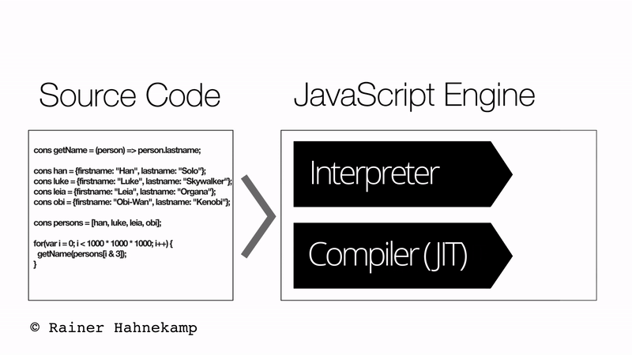

<!--
 * @Author: Hom Yan
 * @Date: 2019-06-13 16:30:35
 * @LastEditors: Hom Yan
 * @LastEditTime: 2019-06-14 16:57:03
 -->
# JavaScript要点：为什么你应该知道引擎是如何工作的
[JavaScript essentials: why you should know how the engine works](https://www.freecodecamp.org/news/javascript-essentials-why-you-should-know-how-the-engine-works-c2cc0d321553/) by `Rainer Hahnekamp` on 2018-07-04

<center>

</center>

在本文中，我想解释一下，使用JavaScript编写应用的开发者应该了解引擎，以便编写的代码正确执行。

你将看到下面的一行代码的函数，返回传入参数的lastName属性。只要给每个对象添加一个属性，结果性能就骤降700%。

正如我将详细解释的那样，JavaScript缺少静态类型会导致这种行为。 曾经被视为优于其他语言（如C＃或Java）的优势，事实证明它更像是“浮士德式交易”。

## 全速制动
通常，我们不需要知道运行代码的引擎的内部机制。 浏览器厂商大力投入使引擎快速运行代码。

太棒了！

让其他人来干重活吧。为什么需要担心引擎是怎么工作的？

在下面的示例中，我们有五个对象存储了星球大战角色的姓氏和名字。函数`getName`返回姓氏的值。我们测下这个函数运行10亿次的总耗时：

```javascript
(() => {
  const han = { firstname: 'Han', lastname: 'Solo' };
  const luke = { firstname: 'Luke', lastname: 'Skywalker' };
  const leia = { firstname: 'Leia', lastname: 'Organa' };
  const obi = { firstname: 'Obi', lastname: 'Wan' };
  const yoda = { firstname: '', lastname: 'Yoda' };
  const people = [han, luke, leia, obi, yoda, luke, leia, obi];
  const getName = person => person.lastname;
  console.time('engine');
  for (var i = 0; i < 1000 * 1000 * 1000; i++) {
    getName(people[i & 7]);
  }
  console.timeEnd('engine');
})();

```

在一台 Intel i7 4510U的设备上，执行时间大概是1.2秒。看起来还不错。现在我们给每个对象额外加一个属性，再执行一次。

```javascript
(() => {
  const han = { firstname: 'Han', lastname: 'Solo', spacecraft: 'Falcon' };
  const luke = { firstname: 'Luke', lastname: 'Skywalker', job: 'Jedi' };
  const leia = { firstname: 'Leia', lastname: 'Organa', gender: 'female' };
  const obi = { firstname: 'Obi', lastname: 'Wan', retired: true };
  const yoda = { lastname: 'Yoda' };
  const people = [han, luke, leia, obi, yoda, luke, leia, obi];
  const getName = person => person.lastname;
  console.time('engine');
  for (var i = 0; i < 1000 * 1000 * 1000; i++) {
    getName(people[i & 7]);
  }
  console.timeEnd('engine');
})();
```

执行时间现在是8.5秒，比第一版要慢7倍。这感觉就像是全速刹车。这是怎么发生的呢？

是时候近距离看下引擎了。

## 组合力量：解释器和编译器
引擎是读取和执行源代码的部分。每个主要的浏览器厂商都有自己的引擎。Mozilla Firefox有Spidermonkey，Microsoft Edge有Chakra/ChakraCore，Apple Safari把引擎命名为 JavaScriptCore。Google Chrome使用V8，同样也是Node.js的引擎。

V8在2008年的发布是引擎历史上的一个关键时刻。V8大幅提升了浏览器对JavaScript的解释速度。

这种大规模改进背后的原因主要在于解释器和编译器的结合。今天，这四个引擎都在使用这个技术。解释器几乎立即执行源代码。编译器生产的机器代码，用户的系统可直接执行。

由于编译器负责生产机器代码，因此它做了优化。 尽管编译阶段需要额外的时间，但编译和优化都会导致更快的代码执行。

现代引擎背后的主要理念是结合两者的优点：
* 解释器的快速应用启动
* 编译器的快速执行

<center>

</center>

实现这两个目标从解释器开始。 并行地，引擎将频繁执行的代码部分标记为“Hot Path(热路径)”，并将它们与在执行期间收集的上下文信息一起传递给编译器。 这个过程允许编译器调整和优化当前上下文的代码。

我们将编译器的行为称为“Just in Time(及时)”或简称为**JIT**。
当引擎运行良好时，您可以想象某些情况下JavaScript甚至优于C++。 难怪引擎的大多数工作都成了“上下文优化”。

<center>

解释器与编译器的交互
</center>

> 1. 引擎加载源码
> 2. 解释器启动应用
> 3. 编译器接收代码：“Hot Path”优先
> 4. 编译器开始优化和编译
> 5. 编译器增量优化代码

## 运行时静态类型：内联缓存
内联缓存（IC）是JavaScript引擎中的主要优化技术。 解释器必须先执行搜索才能访问对象的属性。 该属性可以是对象原型的一部分，具有getter方法，甚至可以通过代理访问。 在执行速度方面，搜索属性非常昂贵。

引擎给每个对象都赋了一个由运行时生产的“类型(type)”。V8称这些为“类型(types)”、隐藏类或者对象形状，这些并非是ECMAScript标准的一部分。对于两个共享同样对象形状的对象，它们的属性必须是完全一样的，而且是一样的顺序。所以对象`{firstname: "Han", lastname: "Solo"}`会被赋予与`{lastname: "Solo", firstname: "Han"}`不一样的类。

有了对象形状的帮助，引擎就可以知道每个属性的内存位置。引擎将这些位置硬编码到访问属性的函数中。

内联缓存所做的就是消除查询操作。难怪这会带来巨大的性能提升。

回到前面的例子：第一次运行的所有对象都有两个属性，`firstname`和`lastname`，而且是一样的顺序。假设这个对象形状的内部名称是`p1`。当编译器应用IC时，会推测出这个函数只接收对象形状`p1`，并立即返回`lastname`的值。

<center>

<div>内联缓存实践（单态）</div>
</center>

然而第二次运行时，我们要处理5个不同对象形状。每个对象都有一个额外的属性，而且`yoda`没有`firstname`属性。在处理多个对象形状时又是怎么样的呢？

## 介入鸭子或多类型
函数式编程有一个众所周知的“鸭子类型”的概念，要求良好的函数可以处理多种类型。在我们的例子中，只要传递的对象都有一个`lastname`属性，一切就没问题。

内联缓存消除昂贵的属性内存定位查询。当在每个属性访问时，对象具有相同的对象形状时，它最有效。这称之为单态IC。

如果我们有多达四种不同的对象形状，我们处于多态IC状态。与单态一样，优化的机器代码“已知”所有四个位置。但它必须检查传递的参数所属的四种可能的对象形状中的哪一种。这导致性能下降。

一旦我们超过四个的阈值，它就会变得非常糟糕。我们现在处于一种所谓的变形IC中。在这种状态下，不再存在对存储器位置的本地缓存。相反，它必须从全局缓存中查找。这导致我们在上面看到的极端性能下降。

## 多态与变形

下图是2个不同对象形状的多态内联缓存。

<center>

<div>多态内联缓存</div>
</center>

以及我们示例中有5种不同对象形状的变形IC：

<center>

<div>变形内联缓存</div>
</center>

## JavaScript Class来拯救

Ok，所以我们有5个对象形状，并进入了变形IC。怎么来解决呢？

我们需要确保引擎把所有的5个对象都标记为同一个对象形状。这意味着我们创建的对象应该包含所有可能的属性。我们可以使用对象字面量，但我发现JavaScript Class是个更好的解决方案。

对于没有定义的属性，我们可以简单的传个`null`或直接放空。构造器会确保这些字段会有值来初始化：

```javascript
(() => {
  class Person {
    constructor({
      firstname = '',
      lastname = '',
      spaceship = '',
      job = '',
      gender = '',
      retired = false
    } = {}) {
      Object.assign(this, {
        firstname,
        lastname,
        spaceship,
        job,
        gender,
        retired
      });
    }
  }
  const han = new Person({
    firstname: 'Han',
    lastname: 'Solo',
    spaceship: 'Falcon'
  });
  const luke = new Person({
    firstname: 'Luke',
    lastname: 'Skywalker',
    job: 'Jedi'
  });
  const leia = new Person({
    firstname: 'Leia',
    lastname: 'Organa',
    gender: 'female'
  });
  const obi = new Person({ firstname: 'Obi', lastname: 'Wan', retired: true });
  const yoda = new Person({ lastname: 'Yoda' });
  const people = [han, luke, leia, obi, yoda, luke, leia, obi];
  const getName = person => person.lastname;
  console.time('engine');
  for (var i = 0; i < 1000 * 1000 * 1000; i++) {
    getName(people[i & 7]);
  }
  console.timeEnd('engine');
})();
```
当我们再次执行这个函数时，会看到执行时间又回到1.2秒了。任务完成！

## 总结
现代JavaScript引擎结合了解释器和编译器的有点：快速应用启动和快速代码执行。

内联缓存是一个很强大的优化技术。当传递给优化后函数的是同一个对象形状，效果是最好的。

我的极端示例展示了不同内联缓存的影响以及变形缓存的性能损失。

使用JavaScript类是一种很好的做法。像TypeScript这样的静态类型转换使单态IC的可能性更大。