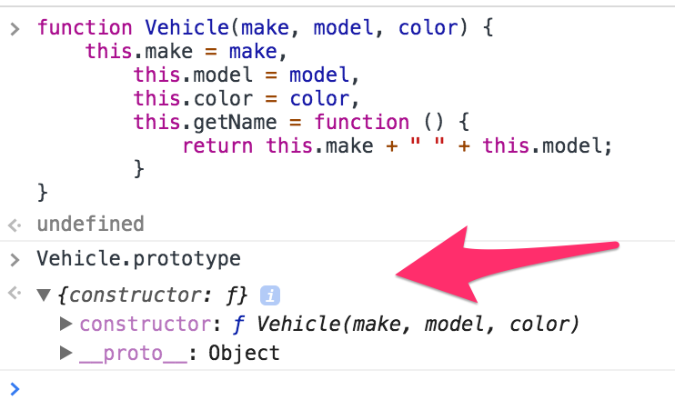
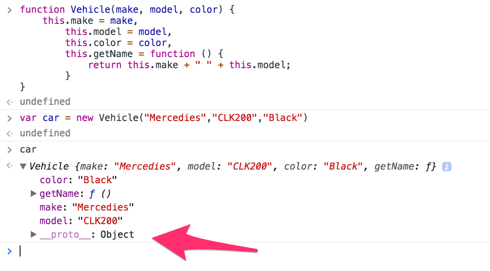
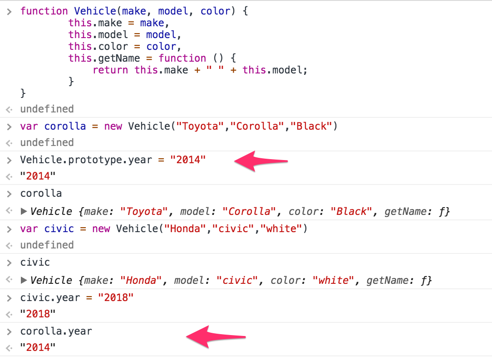
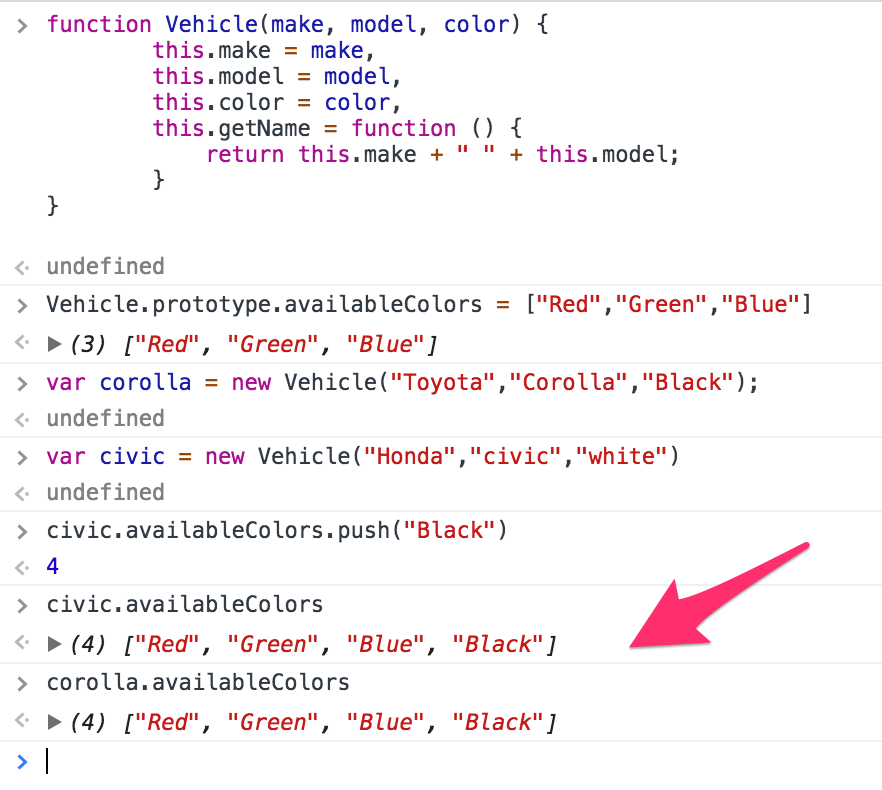
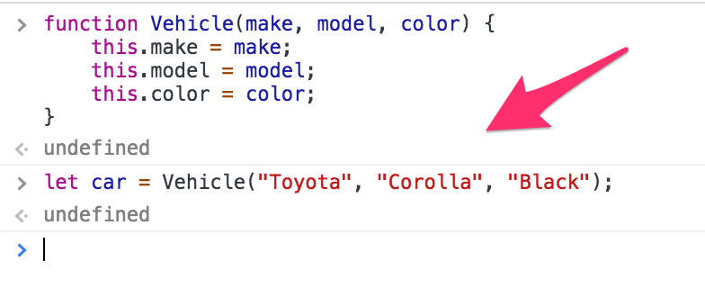
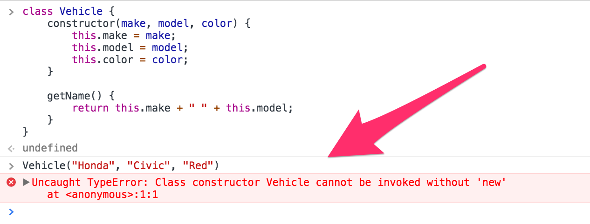
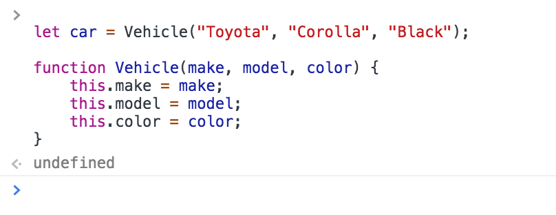
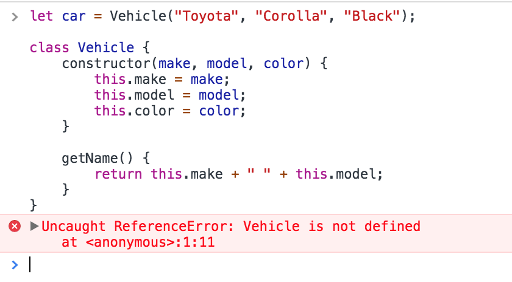
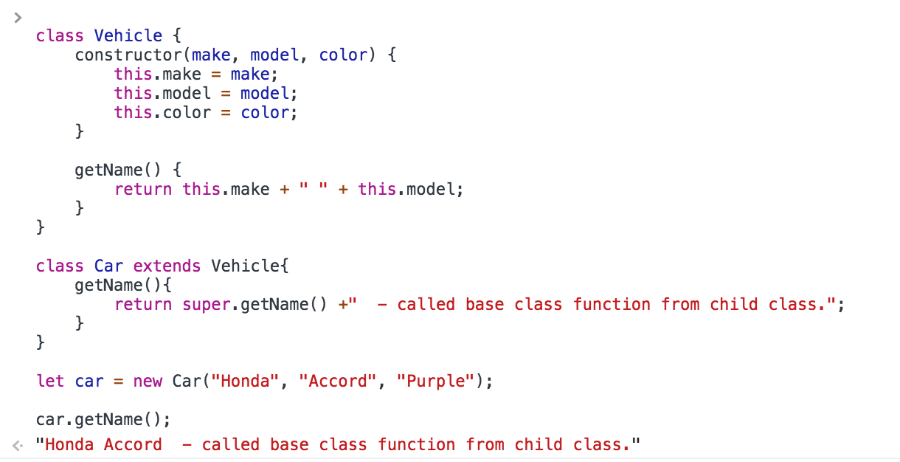

<!--
 * @Author: Hom Yan
 * @Date: 2019-06-19 17:03:21
 * @LastEditors: Hom Yan
 * @LastEditTime: 2019-06-20 17:50:19
 -->

# JavaScript 类 -- 引擎盖之下

[JavaScript Classes — Under The Hood](https://medium.com/tech-tajawal/javascript-classes-under-the-hood-6b26d2667677) by `Majid` on 2018-05-09


JavaScript 类只是现有基于原型继承和构造函数的语法糖。为了理解 JS 类背后的思想，我们需要理解构造函数、原型以及其他相关的概念。

## 1. 构造函数

由于 JavaScript 是一个函数式编程的语言，所有的东西都只是一个函数。为了在 JavaScript 中拥有一个像类（给创建的对象创造一个蓝图）的功能，需要使用构造函数。我们来看下构造函数的原理：

<!--prettier-ignore-->
```javascript
function Vehicle(make, model, color) {
  this.make = make,
  this.model = model,
  this.color = color,
  this.getName = function () {
    return this.make + " " + this.model;
  }
}
```

上面的函数提供了与 Java 类几乎相似的功能，为了创建一个类型为`Vehicle`的对象，我们这么做：

```javascript
let car = new Vehicle('Toyota', 'Corolla', 'Black');
let car2 = new Vehicle('Honda', 'Civic', 'White');
```

完美！不是吗？现在，只要写一行代码，我们就可以随意创建类型为`Vehicle`的对象。

等等，这个技术有一些问题。

当我们写`new Vehicle`时，JavaScript 引擎做的是，给我们的每个对象都拷贝一份`Vehicle`构造函数，所有属性以及方法都拷贝到`Vehicle`的新实例中，这里面有什么问题？

这里的问题是我们不希望在每个对象中重复构造函数的成员函数（方法）。这是多余的。不是吗？另一个问题是我们无法向现有对象添加新属性或方法，如下所示：

```javascript
car2.year = '2012';
```

你需要把它加入到构造函数中：

<!--prettier-ignore-->
```javascript
function Vehicle(make, model, color, year) {
  this.make = make,
  this.model = model,
  this.color = color,
  this.year = year,
  this.getName = function () {
      return this.make + " " + this.model;
  }
}
```

## 2. 原型

在 JavaScript 中，每当一个新的函数被创建时，JavaScript 引擎默认会给它添加一个`prototype`属性。这个属性是一个对象，我们叫做“prototype object(原型对象)”。这个原型对象默认有一个 `constructor` 属性，指向回我们的函数。还有一个属性`__proto__`，看下图：



这个`__proto__`属性叫做 duner proto，指向构造函数的 prototype 属性。

> duner 这个单词来自 python，变量名由双下划线包裹起来的称为 dunder 属性。

每当创建构造函数的新实例时，此属性也会与其他属性和方法一起复制到实例：



现在，这个 prototype 对象可以被用来给构造函数添加新的属性和方法，并且对构造函数的所有实例都是可用的：

```javascript
Vehicle.prototype.year = '2016';
```

Prototype 很酷，但在使用 prototype 时有一些事需要小心。Prototype 的属性和方法在构造函数的所有实例中共享，但是如果改变的是原始类型的属性，只会影响当前实例，而不是所有实例：



另外一点是引用类型的属性是在所有实例中共享，例如，array 类型的属性，如果在一个构造函数的实例中修改了将影响所有实例：



这里有篇很有趣并且描述更详细的关于 prototype 的[文章](https://hackernoon.com/prototypes-in-javascript-5bba2990e04b)。

## 3. 类

我们理解了构造函数和原型，现在就很容易理解类，为什么呢？因为 JavaScript 类只是构造函数结合 prototype 的一种新的书写方式，看下面这个例子：

```javascript
class Vehicle {
  constructor(make, model, color) {
    this.make = make;
    this.model = model;
    this.color = color;
  }

  getName() {
    return this.make + ' ' + this.model;
  }
}
```

我们可以这样来创建类`Vehicle`的实例：

```javascript
let car = new Vehicle('Toyota', 'Corolla', 'Black');
```

如果你对比这个和开头解释的构造函数，是很相似的。

上面的代码中，我们实际上创建了一个`Vehicle`变量，指向了在类里定义的构造函数，而且给变量`Vehicle`的原型上加了一个方法，跟下面是一样的：

```javascript
function Vehicle(make, model, color) {
  this.make = make;
  this.model = model;
  this.color = color;
}

Vehicle.prototype.getName()= function () {
  return this.make + " " + this.model;
}

let car = new Vehicle("Toyota", "Corolla", "Black");
```

因此，这证明了类是做构造函数的一种新方式。是的，但也引进了一些新的东西以及规则来使它更像真实的类。

1. `constructor` 需要 `new`关键字。这意味着我们只有这么做，构造函数才会被调用。
   ```javascript
   let car = new Vehicle('Toyota', 'Corolla', 'Black');
   ```

但是使用构造函数，我们其实可以这么做：



如果使用上面的方式来实例化一个类：



2. Class 方法是不可枚举的。JavaScript 中对象的每个属性都有一个`enumerbale`标志，该标志定义了对该属性执行的某些操作的可用性。 对于在其`prototype`上定义的所有方法，类将此标志设置为`false`。

3. 如果你没有给 class 添加`constructor`，一个默认的空`constructor`将没添加。就像下面：

```javascript
constructor() {}
```

4. 类中的代码总是处于严格模式，这有助于编写无错误的代码，抛出错误，输入错误或编写代码时出现的语法错误，甚至误删某些在其他地方引用的代码。

5. 类声明不会提升。JavaScript 中 hosting(提升)是一种行为，指的是所有声明都会被自动上移到当前作用域的顶部，这个行为让你可以在声明之前使用一个变量或一个函数。

所以类声明不会提升意味着，在声明之前你无法使用一个类，它会返回`not defined`错误，如下：

这是有效的：


但这就不行：


6. 类不允许像构造函数或对象字面量那样做属性值赋值。你只能有函数或 getters/setters。所以在类中没有直接的`property:value`赋值。

## 4. 类功能

### 1. 构造函数

构造函数是类声明中的一个特殊函数，它定义了一个函数，代表类本身。当你新创建一个类实例时，构造函数自动被调用。

```javascript
let car = new Vehicle('Honda', 'Accord', 'Purple');
```

构造函数可以使用`super`关键字来调用它继承的类的构造函数。

> 一个类只能有一个构造函数。

### 2. 静态方法

静态方法是类自身的函数，不在其原型上，不像类中的其他方法，是定义在`prototype`上。

静态方法通过`static`关键字声明，通常用来创建工具函数。调用无需创建类的实例。看下面的例子：

```javascript
class Vehicle {
  constructor(make, model, color) {
    this.make = make;
    this.model = model;
    this.color = color;
  }

  getName() {
    return this.make + ' ' + this.model;
  }

  static getColor(v) {
    return v.color;
  }
}

let car = new Vehicle('Honda', 'Accord', 'Purple');

Vehicle.getColor(car); // "purple"
```

记住，类实例不能调用静态方法。

### 3. Getters/Setters

类也提供 getters/setters 来获取和设置属性值。像下面这样：

```javascript
class Vehicle {
  constructor(model) {
    this.model = model;
  }

  get model() {
    return this._model;
  }

  set model(value) {
    this._model = value;
  }
}
```

getters/setters 是定义在类`prototype`上。

### 4. 子类

子类是 JavaScript 类继承的一种方式，使用`extends`关键字来创建一个类的子类。

看下面的例子：

```javascript
class Vehicle {
  constructor(make, model, color) {
    this.make = make;
    this.model = model;
    this.color = color;
  }

  getName() {
    return this.make + ' ' + this.model;
  }
}

class Car extends Vehicle {
  getName() {
    return this.make + ' ' + this.model + ' in child class.';
  }
}

let car = new Car('Honda', 'Accord', 'Purple');

car.getName(); // "Honda Accord in child class."
```

你可以看到当调用`getName()`函数时，子类里的函数被调用了。

有时我们需要调用基类里的函数。在子类的方法中，我们可以使用`super`关键字来调用基类的方法。

在子类中像这样改变`getName()`函数：

```javascript
class Car extends Vehicle {
  getName() {
    return super.getName() + '  - called base class function from child class.';
  }
}
```

现在，如果你从实例调用`getName()`，它的返回结果应该是这样的：



那么，我们试着解释 JavaScript 类背后的思想，最后我们学习了类的一些功能。

我肯定遗漏了关于这个主题的很多细节，你可以继续阅读下面一些 JavaScript 极客写的很棒的文章，不仅如此，网上还有大量其他文章，可以帮助你抓住这背后的思想。

参考：

1. [https://developer.mozilla.org/en-US/docs/Web/JavaScript/Reference/Classes](https://developer.mozilla.org/en-US/docs/Web/JavaScript/Reference/Classes)
2. [http://2ality.com/2015/02/es6-classes-final.html](http://2ality.com/2015/02/es6-classes-final.html)
3. [https://javascript.info/class](https://javascript.info/class)
4. [https://thejsguy.com/tutorials/javascript-constructor-functions-and-classes](https://thejsguy.com/tutorials/javascript-constructor-functions-and-classes)
5. [https://www.phpied.com/3-ways-to-define-a-javascript-class/](https://www.phpied.com/3-ways-to-define-a-javascript-class/)
