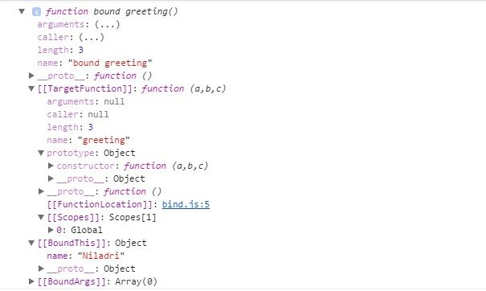

<!--
 * @Author: Hom Yan
 * @Date: 2019-08-02 19:30:10
 * @LastEditors: Hom Yan
 * @LastEditTime: 2019-08-02 20:41:18
 -->

# 指南：JavaScript 中的 call()、apply()以及 bind()

[How-to: call() , apply() and bind() in JavaScript](https://www.codementor.io/niladrisekhardutta/how-to-call-apply-and-bind-in-javascript-8i1jca6jp) by `Niladri Sekhar Dutta` on 2017-06-05

下文中，我们将通过简单的例子来讨论 JavaScript 中`call()`、`apply()`以及`bind()`方法的区别。由于函数在 JavaScript 中也是对象，这三个方法是用来控制函数的调用。`call()`和`apply()`是 ECMAScript 3 引进的，而`bind()`是在 ECMAScript 5 中添加的。

## 使用

你可以使用`call()`/`apply()`立即调用该函数。`bind()`返回一个绑定函数，当稍后执行时，它将对原始函数的调用有正确的上下文(**"this"**)。因此，当函数需要稍后在某些特定事件下调用时，你可以使用`bind()`。

想要掌握 JavaScript 中的 **"this"**，可以阅读[ Understanding "This" in JavaScript](https://www.codementor.io/dariogarciamoya/understanding--this--in-javascript-du1084lyn?icn=post-8i1jca6jp&ici=post-du1084lyn)。

### `call()` OR `Function.prototype.call()`

看下面`call()`的示例代码

```javascript
//Demo with javascript .call()

var obj = { name: 'Niladri' };

var greeting = function(a, b, c) {
  return 'welcome ' + this.name + ' to ' + a + ' ' + b + ' in ' + c;
};

console.log(greeting.call(obj, 'Newtown', 'KOLKATA', 'WB'));
// 输出 welcome Niladri to Newtown KOLKATA in WB
```

`call()`方法中的第一个参数设置 **"this"** 值，该值是调用该函数的对象。在这种情况下，它是上面的 **"obj"** 对象。

其余参数是实际函数的参数。

### `apply()` OR `Function.prototype.apply()`

看下面`apply()`的示例代码

```javascript
//Demo with javascript .apply()

var obj = { name: 'Niladri' };

var greeting = function(a, b, c) {
  return 'welcome ' + this.name + ' to ' + a + ' ' + b + ' in ' + c;
};

// 实际函数的参数数组
var args = ['Newtown', 'KOLKATA', 'WB'];
console.log('Output using .apply() below ');
console.log(greeting.apply(obj, args));

/* 将会输出
  Output using .apply() below
 welcome Niladri to Newtown KOLKATA in WB */
```

与`call()`类似，`apply`方法中的第一个参数设置 **"this"** 值，该值是调用该函数的对象。在这种情况下，它是上面的 **"obj"** 对象。`apply()`方法与`call()`的唯一区别就是，`apply()`方法的第二个参数接受实际函数的参数作为一个数组。

### `bind()` OR `Function.prototype.bind()`

看下面`bind()`的示例代码

```javascript
//Use .bind() javascript

var obj = { name: 'Niladri' };

var greeting = function(a, b, c) {
  return 'welcome ' + this.name + ' to ' + a + ' ' + b + ' in ' + c;
};

// 创建一个拥有相同主体和参数的绑定函数
var bound = greeting.bind(obj);

console.dir(bound); // 返回一个函数

console.log('Output using .bind() below ');

console.log(bound('Newtown', 'KOLKATA', 'WB')); // 调用绑定函数

/* 输出将会是 
Output using .bind() below
welcome Niladri to Newtown KOLKATA in WB */
```

上面`bind()`的示例代码中，我们返回了一个可以稍后调用的携带上下文的绑定函数。我们可以在控制台中看到绑定函数。

<center>

</center>

`bind()`方法的第一个参数在调用绑定函数时设置目标函数中 **"this"** 的值。请注意，如果使用 **"new"** 运算符构造绑定函数，则忽略第一个参数的值。`bind()`方法中第一个参数后面的其余参数作为参数传递，这些参数在调用目标函数时附加到提供给绑定函数的参数之前。

目前就这些了。 感谢您的阅读，我希望这篇文章对面临 JavaScript 的`apply()`、`call()`和`bind()`方法问题的初学者有所帮助。
