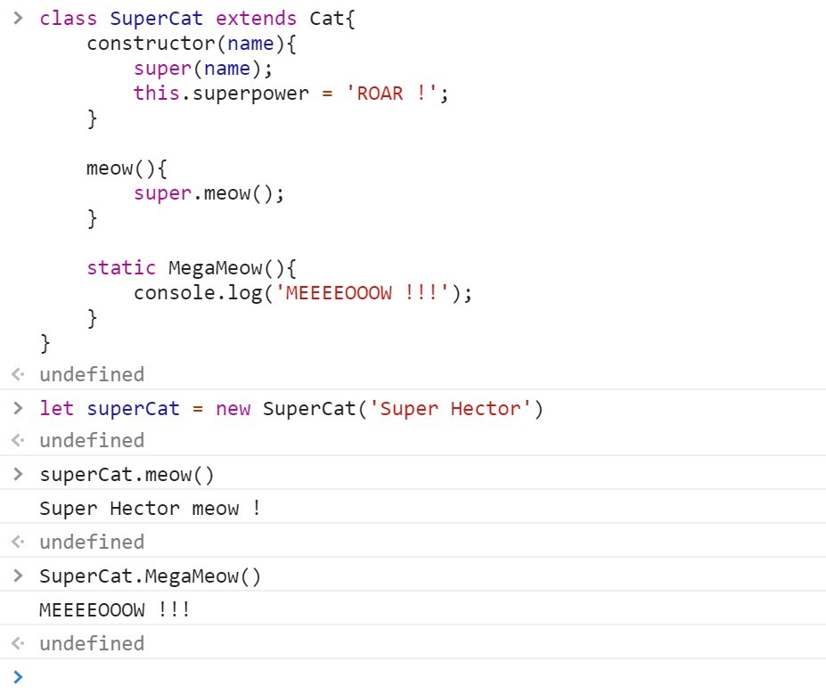

# Javascript : Prototype vs Class

[Javascript : Prototype vs Class](https://medium.com/@parsyval/javascript-prototype-vs-class-a7015d5473b) by `Valentin PARSY` on 2018-04-04


<center><small>“现在有了关键字 class，我们可以像使用任何 OOP 语言一样使用 JS。”--需要阅读以下内容的人</small></center>

我的上一篇文章是关于 TypeScript 中的‘class vs interface’，我很高兴收到了很多反馈。在这些反馈中，我看到有些人在谈论 JavaScript 中的 classes 时迷失了。

然后一句话这句促使我今天来写这篇文章：

> “自 ECMAScript 2015 标准以来，普通 javascript 具有适当的类”

好吧……不，我会告诉你原因。

<hr/>

## 在 class 关键字之前

下面是一个我们在不久前写的例子，关于如何在 JavaScript 中实现`classes`。第一个函数类似一个构造器，这样我们有一个 Cat 类，在这个类里有一个喵喵叫的函数：


<center><small>使用new关键字创建了cat</small></center>

速记：如果我们忘记了`new`关键字？好吧，它也不会抛出错误...你只是重新命名了你的 window。


<center><small>只是关于`this`的引用</small></center>

## prototype 在哪？

在控制台我们可以清晰的看到原型链：


<center><small>你的猫所包含的</small></center>

你的猫是一个有 name 属性的对象，它有一个 **\_\_proto\_\_** 对象包含一个函数 meow 和 Cat 构造函数，这个对象/原型还包含一个**Object**对象（它是基础对象，有点像 Java，它是所有 javascript 对象的基础原型）。你会看到为什么称之为原型**链**。

现在，与“经典”类的工作方式有很大不同的一件事是原型是引用。 这意味着，如果您创造了很多猫，并且在其中一只猫上这么做：

```javascript
delete cat.__proto__.meow;
```

你刚移除了你所有猫的喵喵叫的能力，因为它们都共享对 Cat 原型的引用。

<hr/>

现在我们来创建一个 Dog 类，和猫一样，只是不是喵喵叫，而是吠叫：


<center><small>谁是好孩子？</small></center>

现在，你拥有一条 🐶 和一只 🐱，让我们做一些非常糟糕的事情，禁止，永远不要在工作中尝试：

```javascript
cat.__proto__ = dog.__proto__;
```

现在猫里面有啥：


我的天！！猫可以吠叫了！！它还是一只猫，但它的原型是一条狗。。。如果我告诉你

```javascript
cat instanceof Dog === true;
```

你可以开始理解 JS 是如何将所有内容与对象的原型相关联。

<hr />

看到了吧？这就是 JavaScript 的疯狂之处：你只需要通过改变原型，就可以做任何你想做的事，甚至可以让你的猫吠叫。问题很显然，有了这么多自由，就会发生很多错误。

## 现在我们有 class

我们先来回顾一下 MDN 上关于 Javascript 中类的定义

> ECMAScript2015 中引入的 JavaScript 类，主要是 JavaScript 现有基于原型继承的语法糖。类语法并没有引入新的面向对象的继承模型。

如果这还不够清晰，那么我来演示下为什么它并没有引入新的 OO 模型。

我们使用类语法来继续我们猫和狗的例子：



我们编写的像任何 OOP 语言：**class**，**constructor**，**super**，**extends**，我甚至还加了一个静态函数。但是我们的超级猫看起来是什么样子？


<center><small>明显是一只更大的猫</small></center>

我们使用 extends 事实上是在原型链中增加了一个深度。现在我们有了一个具有名称和超能力的对象，它拥有带有 SuperCat 构造函数的 **\_\_prpto\_\_** 对象和你的 SuperCat 函数 meow，也有一个 **\_\_prpto\_\_** ...

这意味着像之前，你可以删除原型上的一个属性或方法，那将毁坏所有你创建的实例。

什么都没有改变。。。好吧，还是有一点不一样：


<center><small>我们等了20年...</small></center>

你可以尝试像以前一样更改原型，并拥有仍然具有强大 MEOW 的吠叫 SuperCat，或进行其他疯狂的事情，（原型）世界现在就属于你。

<center>

</center>
<hr />

现在你看到了，class 关键字背后，仍然是原型。我希望你在代码中使用时可以考虑到这一点。

我要感谢 FlorianOrpelière（@florpeliere），在我撰写本文之前不久，他就此主题发表了演讲，内容如此清晰，指导性很强，这给我带来了很多启发。
