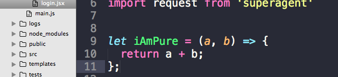

# 什么是纯函数？为什么使用它们？

[JavaScript: What Are Pure Functions And Why Use Them?](https://medium.com/@jamesjefferyuk/javascript-what-are-pure-functions-4d4d5392d49c) by `James Jeffery` on 2017-06-22

<center>

</center>
<center><small>纯函数例子</small></center>

第一次听到“纯函数”这个术语时，我感到很困惑。常规函数有什么问题吗？为什么它需要是纯的？甚至我为什么需要纯函数？

你可能会问同样的问题，除非你早已经知道什么是纯函数。它们其实真的很简单。我们来看下...

## 什么是纯函数？

一个纯函数的定义是：

1. 如果传入同样的参数，该函数将始终返回同样的结果。它不依赖于程序执行期间的任何状态或数据变更。它必须只取决于其入参。

2. 该函数不会产生任何可观察到的副作用，例如网络请求，输入和输出设备或数据突变。

这就是纯函数的全部了。如果满足上面 2 个要求，那它就是纯的。你过去可能已经创建过纯函数，在你没有意识到的情况下。

在向你展示纯函数和非纯函数的例子之前，让我们先讨论下可怕的“副作用”。

## 什么是可观察到的副作用？

一个可观察到的副作用指的是**任何**函数内与函数外世界的交互。可以是改变函数外的一个变量，在函数内调用另一个函数。

**注意：** 如果一个纯函数调用了另一个纯函数，这并不是副作用，这个调用的函数依然是纯的。

副作用包括，但不限于：

- 发出 HTTP 请求
- 改变数据
- 打印到屏幕或者控制台
- DOM 查询或操作
- Math.random()
- 获取当前时间

副作用本身并不是不好的，而且通常也是必需的。除非一个函数声明为纯的，那么它不应该包含任何副作用。并非所有的函数都需要或应该是纯的。我过会儿会讨论纯函数的用例。

但首先，让我们看下纯函数和非纯函数的一些例子...

## JavaScript 中的纯函数例子

为了演示，下面是一个计算含税产品价格的纯函数（英国税率为 20%）：

```javascript
function priceAfterTax(productPrice) {
  return productPrice * 0.2 + productPrice;
}
```

它通过了声明为纯函数的 2 个条件。不依赖于任何额外输入，不改变数据，不包含任何副作用。

如果你以同样的参数运行一百万次，得到的结果也都是一样的。

## JavaScript 中的非纯函数

我已经展示了一个纯函数，现在我们来看下 JavaScript 中的非纯函数：

```javascript
var tax = 20;
function calculateTax(productPrice) {
  return productPrice * (tax / 100) + productPrice;
}
```

暂停一下，看看你能否猜出为什么这个函数是非纯的。

如果你说是因为这个函数依赖于一个额外的变量，那么恭喜你！答对了！一个纯函数不能依赖于外部变量。有一个条件没通过，那么这个函数就是非纯的。

## 为什么 JavaScript 中的纯函数很重要？

纯函数被广泛应用在函数式编程中。而且，像 ReactJS 和 Redux 这样的库都需要使用纯函数（ps. 如果你还不知道 ReactJS，感觉学吧，它将改变你的生活）。

但是，纯函数也可以在不依赖单一编程范例的常规 JavaScript 中使用。 您可以混合使用纯函数和非纯函数，这完全没问题。

并非所有的函数都需要或应该是纯的。例如，用于操纵 DOM 的按钮事件处理器就不是纯函数的理想选择。但是，事件处理器可以调用其他纯函数，这将减少应用里非纯函数的数量。

## 可测试性和重构

另一个尽可能使用纯函数的原因是测试和重构。

使用纯函数的一个主要好处是，它们是即时可测的。如果你传入相同的参数，它们会永远产生相同的结果。

它们也使维护和重构代码变的更多容易。你可以改变一个纯函数，而不用担心不可预期的副作用搞垮整个应用，陷入调试地狱。

合理使用纯函数可以提升代码质量。这是一种带来很多好处的更清洁的方式。

注意，纯函数并不仅限于 JavaScript。想要更深入了解纯函数的说明，可以看[这里](https://en.wikipedia.org/wiki/Pure_function)。我也高度推荐[阅读这篇](https://drboolean.gitbooks.io/mostly-adequate-guide/ch3.html)和[这篇](https://toddmotto.com/pure-versus-impure-functions)。
